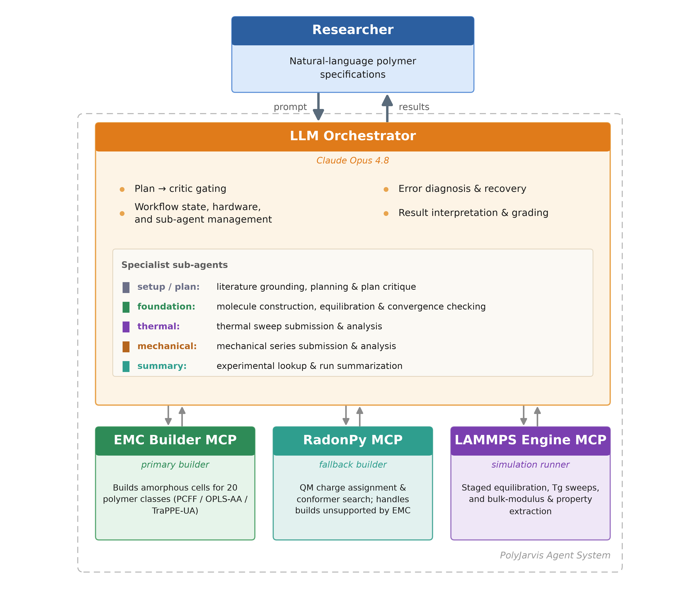
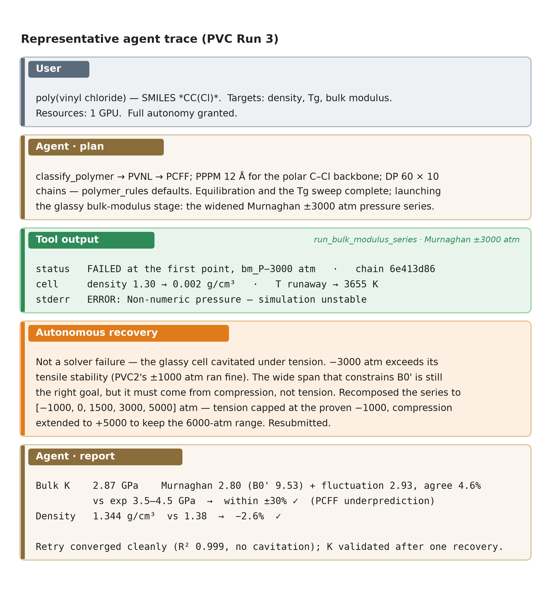

# PolyJarvis

**PolyJarvis** is an AI-driven framework for autonomous polymer property prediction via all-atom molecular dynamics simulation. A researcher describes a polymer system in natural language; an LLM agent (Claude) then handles the entire workflow — from SMILES string to computed material properties — by orchestrating two MCP servers: one for molecular construction and one for remote GPU simulation.



---

## Overview

Traditional polymer MD workflows require manual intervention across several software environments (RDKit, RadonPy, LAMMPS, MDAnalysis) and substantial domain expertise to set up correctly. PolyJarvis automates this end-to-end by giving an LLM agent structured tools for each stage, along with documented decision rules (force field selection, convergence thresholds, fit quality checks) that ensure physical correctness without hand-holding.

### Properties computed

- Glass transition temperature (T<sub>g</sub>) via density–temperature sweep with bilinear fit
- Equilibrated density at target T and P
- Isothermal bulk modulus via volume fluctuation method
- Radial distribution functions (RDF) for structural analysis
- End-to-end vector distributions for chain conformation analysis

---

## Architecture

The system is organized into four sequential stages, each backed by MCP tools the agent can call directly:

```
SMILES string
     │
     ▼
┌─────────────────────────────────────────────┐
│  STAGE 1 · Molecular Construction          │
│  RadonPy MCP Server (local)                │
│                                             │
│  classify_polymer → build_molecule →        │
│  assign_charges → polymerize →              │
│  assign_forcefield → generate_cell →        │
│  save_lammps_data                           │
└────────────────────┬────────────────────────┘
                     │  .data file
                     ▼
┌─────────────────────────────────────────────┐
│  STAGE 2 · Equilibration                   │
│  LAMMPS Engine MCP Server (Lambda GPU)     │
│                                             │
│  generate_equilibration_workflow →          │
│  run_lammps_chain (6-stage auto protocol)  │
│  minimize → compress → heat → NPT → cool   │
└────────────────────┬────────────────────────┘
                     │  equilibrated cell
                     ▼
┌─────────────────────────────────────────────┐
│  STAGE 3 · T_g Measurement                 │
│  Temperature sweep 600K → 160K (20K steps) │
│  extract_tg → bilinear F-stat fit          │
└────────────────────┬────────────────────────┘
                     │
                     ▼
┌─────────────────────────────────────────────┐
│  STAGE 4 · Property Extraction & Validation │
│  extract_equilibrated_density               │
│  extract_bulk_modulus (volume fluctuation)  │
│  calculate_rdf · extract_end_to_end_vectors │
│  Compare to experimental benchmarks         │
└─────────────────────────────────────────────┘
```
Below is a sample conversation between a user and the agent:


---

## Repository Structure

```
PolyJarvis/
├── guides/                         # Stage-by-stage execution guides (READ FIRST)
│   ├── STAGE_INDEX.md              # Navigation hub — start here
│   ├── STAGE_1_MOLECULAR_CONSTRUCTION.md
│   ├── STAGE_2_EQUILIBRATION.md
│   ├── STAGE_3_TG_MEASUREMENT.md
│   ├── STAGE_4_ANALYSIS.md
│   └── TOOLS_REFERENCE.md          # Complete MCP tool signatures
├── mcp-servers/
│   ├── mcp-radonpy-server/         # Molecular construction (RadonPy wrapper)
│   │   └── src/server.py           # 18+ MCP tools
│   └── mcp-lammps-engine/          # Simulation & analysis (LAMMPS + SSH)
│       ├── server.py               # 18+ MCP tools
│       ├── script_generator.py     # Template → filled .in scripts
│       ├── remote_executor.py      # Paramiko SSH/SFTP wrapper
│       ├── utilities.py            # Remote file utilities
│       └── templates/              # 9 validated LAMMPS script templates
├── data/                           # Completed example runs
│   ├── PE{1,2,3}/                  # Polyethylene
│   ├── PEG{1,2,3}/                 # Poly(ethylene glycol)
│   ├── PMMA{1,2,3}/                # Poly(methyl methacrylate)
│   └── PS{1,2,3}/                  # Polystyrene
├── figures/
│   └── figure1_architecture.png
└── Task_TEMPLATE.txt               # Template for specifying new simulation tasks
```

---

## MCP Servers

### `mcp-radonpy-server` (local)

Wraps the [RadonPy](https://github.com/RadonPy/RadonPy) library for molecule construction. All heavy computation runs locally via RDKit, Psi4, and RadonPy.

Key tools: `classify_polymer`, `build_molecule_from_smiles`, `submit_polymerize_job`, `submit_assign_charges_job`, `assign_forcefield`, `submit_generate_cell_job`, `save_lammps_data`, `get_job_status`, `get_job_output`

### `mcp-lammps-engine` (remote)

Manages simulation submission and analysis on a remote GPU server (tested on Lambda Labs A10/A100 instances) via SSH/SFTP (Paramiko). Simulation chains run as `nohup` background processes and survive MCP server disconnections.

Key tools: `generate_script`, `run_lammps_script`, `run_lammps_chain`, `generate_equilibration_workflow`, `get_run_status`, `get_run_output`, `read_remote_log`, `extract_tg`, `extract_equilibrated_density`, `extract_bulk_modulus`, `calculate_rdf`, `extract_end_to_end_vectors`, `check_equilibration`, `unwrap_coordinates`


---

## Setup

### Prerequisites

- Python ≥ 3.9 with [RadonPy](https://github.com/RadonPy/RadonPy), RDKit, Psi4, and MDAnalysis installed locally
- LAMMPS (GPU build) on a remote server, accessible via SSH key
- `fastmcp` Python package for both MCP servers
- Paramiko for SSH communication

### Configuration

Copy and populate the `.env.example` files in each server directory:

**`mcp-lammps-engine/.env`**
```env
LAMBDA_HOST       = <remote_server_ip>
LAMBDA_USER       = <ssh_username>
LAMBDA_KEY        = ~/.ssh/your_key
LAMBDA_WORKDIR    = /home/<user>/simulations
LAMBDA_LAMMPS     = /home/<user>/lammps/build/lmp
CONDA_ENV         = radonpy
MDA_SCRIPTS_DIR   = /home/<user>/analysis_scripts
```

**`mcp-radonpy-server/.env`**
```env
RADONPY_PATH = /path/to/RadonPy
```

### Running the MCP Servers

```bash
# Start the RadonPy server
cd mcp-servers/mcp-radonpy-server
python src/server.py

# Start the LAMMPS engine server
cd mcp-servers/mcp-lammps-engine
python server.py
```

Connect both servers to your Claude Desktop configuration, then describe your polymer system to the agent.

---

## Usage

The agent is guided by the stage files in `guides/`. For a new simulation, the agent reads `STAGE_INDEX.md` first, then follows the appropriate stage file. The critical workflow invariants are:

1. **`classify_polymer(smiles)` must be called first** — determines force field and charge method for the entire run.
2. **Force field assignment happens after polymerization**, never before.
3. **All LAMMPS scripts are generated via `generate_script()`** — no hand-written `.in` files.
4. **`nvidia-smi` is checked before every GPU submission.**
5. **T<sub>g</sub> is never reported without verifying R² ≥ 0.90** (ACCEPTABLE minimum).

A `Task_TEMPLATE.txt` is provided in the repo root to help structure new simulation requests.

---

## Tech Stack

| Component | Library |
|-----------|---------|
| Molecular construction | RadonPy, RDKit |
| Quantum chemistry (charges) | Psi4 |
| Force fields | GAFF2 / GAFF2_mod (via RadonPy) |
| MD simulation | LAMMPS (GPU build) |
| Remote execution | Paramiko (SSH/SFTP) |
| Trajectory analysis | MDAnalysis |
| T<sub>g</sub> fitting | SciPy (F-stat exhaustive split) |
| MCP framework | FastMCP |

---

## License

See [LICENSE](LICENSE).
